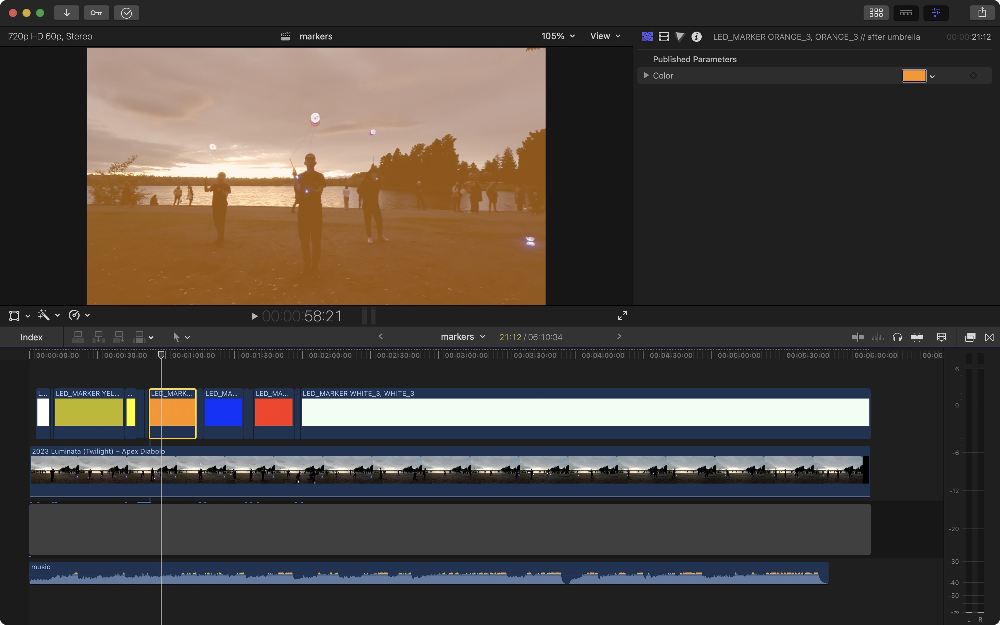

# diabolo light programs

A collection of programs using [ChaosNuggets/Diabolo_Light](https://github.com/ChaosNuggets/Diabolo_Light).

## Usage

PlatformIO is configured to upload a `src/main.cpp` file. Choose which program to use by symlinking:

    ln -Fs single_color.cpp src/main.cpp

## `src/color_lab.cpp`

This program is used to pick colors that look good on the LED kit.

## `src/single_color.cpp`

This program shows a color on initial button press, and will turn off on the 2nd press.

## `src/genshin-fountain-*.cpp`

These programs are used to create a performance consisting of scenes which are defined by colors and transitions between colors. Contains generic structs which I hope to pull out into a separate file eventually.

I use Final Cut Pro's Export XML functionality and a custom script `src/read_fcp_xml.py` to facilitate definition of scenes for this program. Not enough time to document now, but here's a screenshot:

